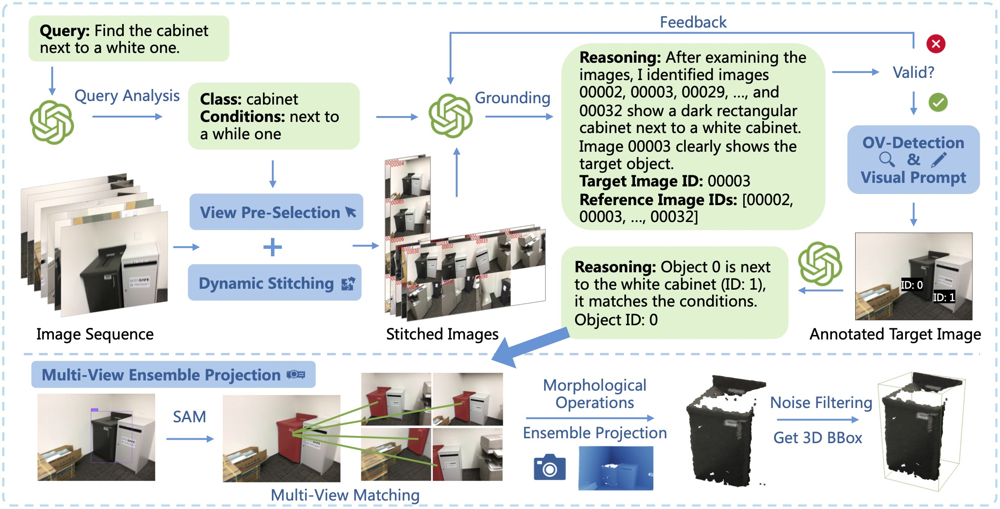
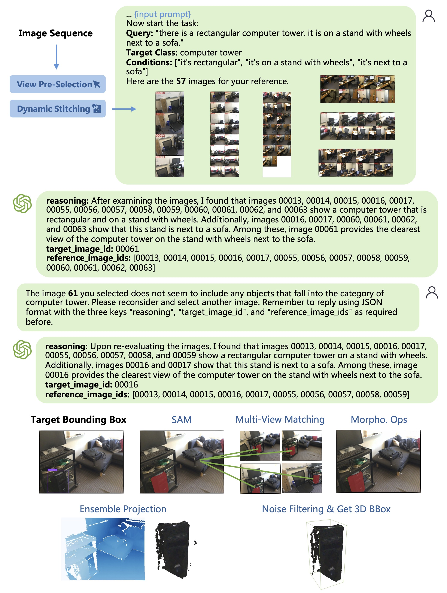
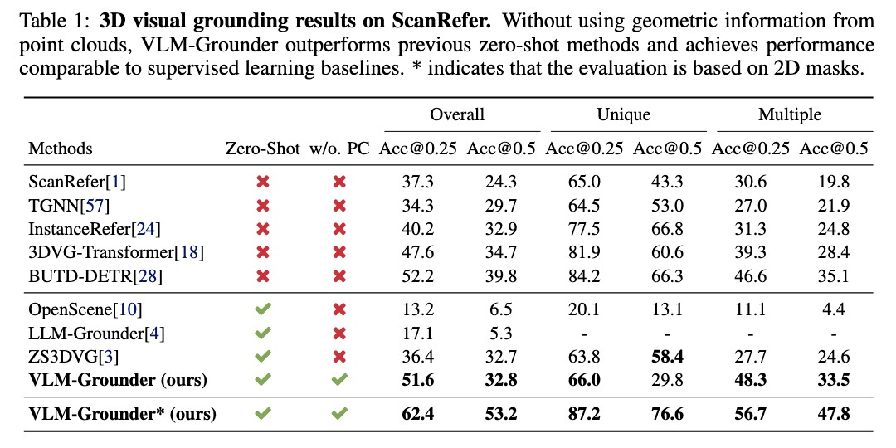
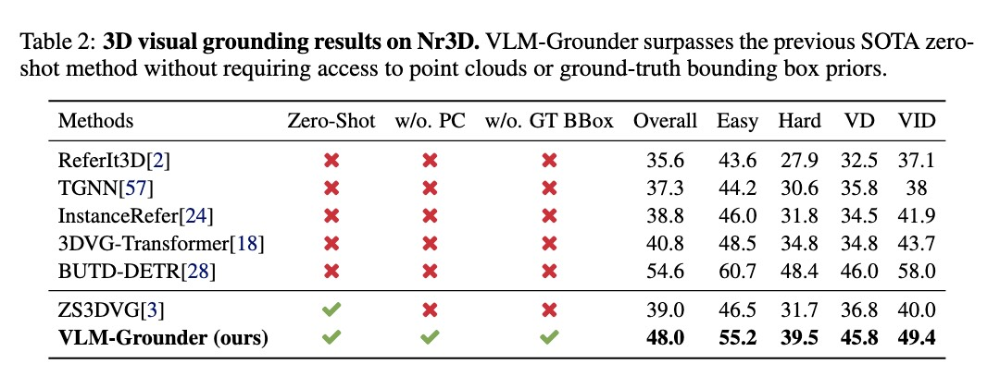

<br>
<p align="center">
<h1 align="center"><strong>VLM-Grounder: A VLM Agent for Zero-Shot 3D
Visual Grounding</strong></h1>
  <p align="center">
    <a href='https://runsenxu.com/' target='_blank'>Runsen Xu</a>&emsp;
    <a href='https://github.com/huang583824382' target='_blank'>Zhiwei Huang</a>&emsp;
    <a href='https://tai-wang.github.io/' target='_blank'>Tai Wang</a>&emsp;
    <a href='http://yilunchen.com/about' target='_blank'>Yilun Chen</a>&emsp;
    <a href='https://oceanpang.github.io/' target='_blank'>Jiangmiao Pang*</a>&emsp;
    <a href='http://dahua.site/' target='_blank'>Dahua Lin</a>&emsp;
    <br>
    The Chinese University of Hong Kong&emsp;Shanghai AI Laboratory&emsp;Zhejiang University
  </p>
</p>

<p align="center">
  <a href="http://arxiv.org/abs/2308.16911" target='_**blank**'>
    
  </a> 
  <a href="https://arxiv.org/pdf/2308.16911.pdf" target='_blank'>
    
  </a> 
  <a href="https://runsenxu.com/projects/VLM-Grounder" target='_blank'>
    
  </a>
  <a href="" target='_blank'>
    
  </a>
</p>

## 🏠 About
<div style="text-align: center;">
    
</div>
We present VLM-Grounder, a novel framework using vision-language models (VLMs) for zero-shot 3D visual grounding based solely on 2D images. VLM-Grounder dynamically stitches image sequences, employs a grounding and feedback scheme to find the target object, and uses a multi-view ensemble projection to accurately estimate 3D bounding boxes. Experiments on ScanRefer and Nr3D datasets show VLM-Grounder outperforms previous zero-shot methods, achieving 51.6% Acc@0.25 on ScanRefer and 48.0% Acc on Nr3D, without relying on 3D geometry or object priors.

## 🔥 News
- [2024-10-17] We release the [paper]() of VLM-Grounder and all the codes! We are looking for self-motivated students to conduct research regarding VLM (agent) for 3D perception. Please send an email to runsxu@gmail.com with your CV if you are interested! 🔥
- [2024-09-04] VLM-Grounder has been accepted by CoRL 2024! 🎉

## 📋 Contents
- [🔍 Overview](#-overview)
- [📦 Getting Started](#-getting-started)
- [🔗 Citation](#-citation)
- [📄 License](#-license)
- [👏 Acknowledgements](#-acknowledgements)

## 🔍 Overview
### Demo
<p align="center">
  
</p>

### Experimental Results
<p align="center">
  
</p>

<p align="center">
  
</p>


## 📦 Getting Started
### Installation

First, clone the repository with submodules:
```bash
git clone --recurse-submodules https://github.com/OpenRobotLab/VLM-Grounder.git
cd VLM-Grounder
```

To ensure compatibility, please use the following specific versions of the submodules:

- Grounding-DINO-1.5-API @ 414e737
- pats @ 98d2e03

### Environment Setup

This project is tested on Python 3.10.11:
```bash
conda create -n "vlm-grounder" python=3.10.11
conda activate vlm-grounder
```

Install PyTorch 2.0.1. For detailed instructions, refer to [PyTorch's official page](https://pytorch.org/get-started/previous-versions/):
```bash
conda install pytorch==2.0.1 torchvision==0.15.2 torchaudio==2.0.2 pytorch-cuda=11.7 -c pytorch -c nvidia
```

Then, install the required Python packages and PyTorch3D:
```bash
pip install -r requirements.txt
pip install "git+https://github.com/facebookresearch/pytorch3d.git"
```

**SAM-Huge:** Download the SAM-Huge weight file from [here](https://huggingface.co/spaces/abhishek/StableSAM/blob/main/sam_vit_h_4b8939.pth) and place it in the `checkpoints/SAM` folder.

**PATS:** For image matching, we use PATS. Download the required [weights](https://drive.google.com/drive/folders/1SEz5oXVH1MQ2Q9lzLmz_6qQUoe6TAJL_?usp=sharing) and place them in the `3rdparty/pats/weights` folder.

Install the tensor-resize module:
```bash
cd 3rdparty/pats/setup
python setup.py install
cd ../../..
```

The PATS weights folder structure should look like this:
```
pats
├── data
└── weights
    ├── indoor_coarse.pt
    ├── indoor_fine.pt
    ├── indoor_third.pt
    ├── outdoor_coarse.pt
    ├── outdoor_fine.pt
    └── outdoor_third.pt
```

### Setup API Keys

#### 1. OpenAI
Set your OpenAI API key in `vlm_grounder/utils/my_openai.py`:
```python
api_key = "your_openai_api_key"  # sk-******
```

#### 2. Grounding-DINO-1.5-API
If you choose to use Grounding-DINO-1.5, please install Grounding-DINO-1.5-API and set the API key.

Install the Grounding-DINO-1.5-API:
```bash
cd 3rdparty/Grounding-DINO-1.5-API
pip install -v -e .
cd ../..
```

Set the Grounding-DINO-1.5-API key in `vlm_grounder/utils/my_gdino.py` (you can request it from [DeepDataSpace](https://deepdataspace.com)):
```python
api_key = "your_gdino_api_key" 
```

### Data Preparation

Navigate to the dataset folder:
```bash
cd data/scannet/
```

#### 1. Prepare ScanNet Data

Download the [ScanNet dataset](https://github.com/ScanNet/ScanNet) and organize the data folder structure as follows: 
```
data/
└── scannet
    ├── grounding
    ├── meta_data
    ├── scans  # Place ScanNet data here
    │   ├── scene0000_00
    │   ├── scene0000_01
    │   ...
    │
    └── tools
```

#### 2. Sample Posed Images

We extract one frame out of every 20, requiring approximately 850 seconds and 27GB of disk space:
```bash
python tools/extract_posed_images.py --frame_skip 20 --nproc 8  # using 8 processes
```

This will generate the `data/scannet/posed_images` folder.

#### 3. Generate Dataset Info File

Run the script to batch load ScanNet data:
```bash
python tools/batch_load_scannet_data.py
```

This will export the ScanNet data to the `data/scannet/scannet_instance_data` folder.

Update the info file with posed images information:
```bash
python tools/update_info_file_with_images.py
```

### Run VLM-Grounder

First, set the path environment variable:
```bash
cd path/to/VLMGrounder
export PYTHONPATH=$PYTHONPATH:path/to/VLMGrounder
```

We release the test data used in our paper in the `outputs/query_analysis` folder (scanrefer_250.csv and nr3d_250.csv).

#### 1. Download Cached Data
We provide some cached data for our test data to save the cost of running the entire pipeline, which contains:
1. [Exhaustive matching data](https://drive.google.com/file/d/1e17MOnJRsgm1uLuTPOH8Rz6tfAWAH3Uv/view?usp=drive_link) (containing all ScanRefer validation scenes and scenes in nr3d_250).
2. [GDINO detect results](https://drive.google.com/file/d/1x2sx_G32Zbv7zwPWHZLtJoMP9i9NlS6D/view?usp=drive_link) (containing GDINO 1.5 pro detect results in scanrefer_250 and nr3d_250).
3. [Global cache folder](https://drive.google.com/file/d/103EXV8FOmU_T5EC-MMiRwuzqSnTq4Bp3/view?usp=drive_link) (containing category_judger, new detections, and query_analysis results for scanrefer_250 and nr3d_250).

Cached data folder structure: 
```bash
data
└── scannet
    └── scannet_match_data
        └── exhaustive_matching.pkl # Exhaustive matching data

outputs
├── global_cache # Global cache folder
│   ├── category_judger
│   ├── gdino_cache
│   └── query_analysis_v2
└── image_instance_detector # GDINO detect results
    ├── Grounding-DINO-1_nr3d_test_top250_pred_target_classes
    └── Grounding-DINO-1_scanrefer_test_top250_pred_target_classes

```

If you want to use new data, please refer to the following steps 2, 3, 4, 5, and 6 to prepare data. If you want to use our test data, jump to [step 7](#7-vlm-grounding) directly.

#### 2. Prepare ScanRefer Data

Convert ScanRefer to the Referit3D format:
```bash
python data/scannet/tools/convert_scanrefer_to_referit3d.py --input_json_path data/scannet/grounding/scanrefer/ScanRefer_filtered_val.json --output_csv_path data/scannet/grounding/referit3d/*.csv
```

Subsample the CSV file for quick experiments:
```bash
python vlm_grounder/utils/csv_utils.py --csv_file data/scannet/grounding/referit3d/*.csv --sample_num 250
```

Calculate the fine-grained categories (e.g., Unique, Easy, VD):
```bash
python data/scannet/tools/pre_compute_category.py --vg_file data/scannet/grounding/referit3d/*.csv
```

#### 3. Exhaustive Matching in the Scene

Use PATS to obtain exhaustive matching data:
```bash
python vlm_grounder/tools/exhaustive_matching.py --vg_file data/scannet/grounding/referit3d/*.csv
```

This will generate `data/scannet/scannet_match_data/exhaustive_matching.pkl`, containing exhaustive matching data for each scene. Please note this process can take a long time (~20 minutes per scene). 

**Note**: Using cached data provided in step 1 may save some time.

#### 4. Query Analysis

Run the QueryAnalysis module to analyze each query and get the predicted target class and conditions:
```bash
python vlm_grounder/tools/query_analysis.py --vg_file data/scannet/grounding/referit3d/*_relations.csv
```

The output will be in the `outputs/query_analysis` folder. Predicted target class accuracy typically exceeds 98%.

#### 5. Instance Detection

Run the ImageInstanceDetector module to detect target class objects for each image. You can use Yolov8-world or Grounding-DINO-1.5-Pro for object detection. If using YOLO, `checkpoints/yolov8_world/yolov8x-worldv2.pt` will be downloaded automatically:
```bash
python vlm_grounder/tools/image_instance_detector.py --vg_file outputs/query_analysis/*.csv --chunk_size -1 --detector [yolo|gdino]
```

Output results will be in the `outputs/image_instance_detector` folder.

**Note**: If using gdino, ensure your quota is sufficient as this operation is quota-intensive. Using cached data provided in step 1 may save some time and quota.

#### 6. View Pre-Selection

Run the ViewPreSelection module to locate all images containing the predicted target class. This process takes about 0.7 seconds per sample:
```bash
python vlm_grounder/tools/view_pre_selection.py --vg_file outputs/query_analysis/*.csv --det_file outputs/image_instance_detector/*/chunk*/detection.pkl
```

A new CSV file will be produced in the QueryAnalysis output directory, with the suffix `_with_images_selected_diffconf_and_pkl` appended.

#### 7. VLM Grounding

Run the VisualGrounder module. Intermediate results with visualization will be saved in `outputs/visual_grounding`.

A sample `run.sh` script is provided for ease, which can be modified to change parameters. 
Please change the `VG_FILE`, `DET_INFO`, `MATCH_INFO`, `DATE`, and `EXP_NAME` variables accordingly.

Note: The sampled data tested in the paper is at `outputs/query_analysis/nr3d_250.csv` and `outputs/query_analysis/scanrefer_250.csv`. 
```bash
#!/usr/bin/zsh
source ~/.zshrc

# Initial visual grounding
VG_FILE=outputs/query_analysis/*_relations_with_images_selected_diffconf_and_pkl.csv

DET_INFO=outputs/image_instance_detector/*/chunk*/detection.pkl

MATCH_INFO=data/scannet/scannet_match_data/*.pkl

DATE=2024-06-21
EXP_NAME=test 

GPT_TYPE=gpt-4o-2024-05-13
PROMPT_VERSION=3

python ./vlm_grounder/grounder/visual_grouder.py \
  --from_scratch \
  --post_process_component \
  --post_process_erosion \
  --use_sam_huge \
  --use_bbox_prompt \
  --vg_file_path ${VG_FILE} \
  --exp_name ${DATE}_${EXP_NAME} \
  --prompt_version ${PROMPT_VERSION} \
  --openaigpt_type ${GPT_TYPE} \
  --skip_bbox_selection_when1 \
  --det_info_path ${DET_INFO} \
  --matching_info_path ${MATCH_INFO} \
  --use_new_detections \
  --dynamic_stitching \
  --online_detector [yolo|gdino]
```

#### 8. Nr3D Evaluation

For Nr3D, we need to match the predicted bbox with the gt bbox before evaluation. We provide 3 evaluation methods: 2D IoU, GT Bbox IoU, and GT Bbox Distance. 

 - GT Bbox Distance: Choose the GT bbox with the smallest distance to the predicted bbox, which is used for Nr3D in the paper.
 - GT Bbox IoU: Choose the GT bbox with the highest IoU with the predicted bbox.
 - 2D IoU: Use 2d mask to compute IoU for evaluation. 

```bash
python vlm_grounder/eval/accuracy_evaluator.py --method [2d_iou|gtbbox_iou|gtbbox_dist] --exp_dir 
outputs/visual_grouding/*
```

Note that to use 2D IoU matching, you need to unzip the `{scene_id}_2d-instance-filt.zip` files from the ScanNet dataset before running the evaluation.

#### Reminder
Some unused features have been temporarily left in the codes. They were relevant during the development phase but are not related to the final results. You can ignore them. If you encounter any issues, feel free to open an issue at any time.

## 🔗 Citation

If you find our work and this codebase helpful, please consider starring this repo 🌟 and cite:

```bibtex
@inproceedings{xu2024vlmgrounder,
  title={VLM-Grounder: A VLM Agent for Zero-Shot 3D Visual Grounding},
  author={Xu, Runsen and Huang, Zhiwei and Wang, Tai and Chen, Yilun and Pang, Jiangmiao and Lin, Dahua},
  booktitle={CoRL},
  year={2024}
}
```

## 📄 License
<a rel="license" href="http://creativecommons.org/licenses/by-nc-sa/4.0/"></a>
<br />
This work is under the <a rel="license" href="http://creativecommons.org/licenses/by-nc-sa/4.0/">Creative Commons Attribution-NonCommercial-ShareAlike 4.0 International License</a>.

## 👏 Acknowledgements
The authors would like to thank [Tianhe Ren](https://rentainhe.github.io/) and [Lei Zhang](https://www.leizhang.org/) from The International Digital Economy Academy (IDEA) for providing access to the excellent [Grounding DINO-1.5](https://github.com/IDEA-Research/Grounding-DINO-1.5-API) model and [Junjie Ni](https://github.com/xuanlanxingkongxia) from Zhejiang University for the help with [PATS](https://zju3dv.github.io/pats/).
